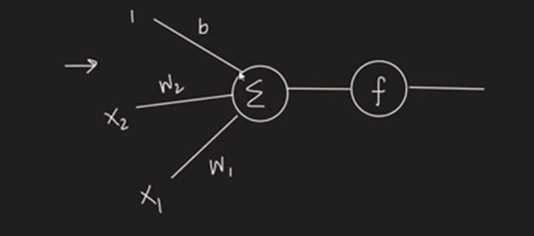

# Day 2 - Perceptron

## What is a Perceptron?

A **Perceptron** is one of the simplest supervised machine learning algorithms and serves as the **basic building block of Deep Learning**.

It is a mathematical model that attempts to mimic a biological neuron and is used for **binary classification problems**.

### Perceptron Structure

### Components

- **Inputs (x₁, x₂, ..., xₙ)** → Features of the data
- **Weights (w₁, w₂, ..., wₙ)** → Importance assigned to each feature
- **Bias (b)** → Helps shift the decision boundary
- **Activation Function (f)** → Converts the output into a prediction

---

## Mathematical Representation

The weighted sum is calculated as:

\[
z = w_1x_1 + w_2x_2 + ... + w_nx_n + b
\]

or

\[
z = W^T X + b
\]

where:

- `W` = Weight Vector
- `X` = Input Vector
- `b` = Bias

The value `z` is then passed through an activation function:

\[
\hat{y} = f(z)
\]

The activation function brings the output into a desired range and helps make a prediction.

---

# Perceptron Learning

The goal of training a perceptron is to find a decision boundary that correctly separates positive and negative classes.

---

## Case 1: Positive Point Misclassified as Negative

Suppose a point that should belong to the positive class is incorrectly classified as negative.

We update the line by **adding the point coordinates**.

### Example

Current Decision Boundary:

\[
2x + 3y + 5 = 0
\]

Misclassified Positive Point:

\[
(x,y) = (1,3)
\]

Represent the point as:

\[
(1,3,1)
\]

Current coefficients:

\[
(2,3,5)
\]

Add them:

\[
(2,3,5) + (1,3,1)
\]

Result:

\[
(3,6,6)
\]

### New Decision Boundary

\[
3x + 6y + 6 = 0
\]

This shifts the boundary toward correctly classifying the positive point.

---

## Case 2: Negative Point Misclassified as Positive

Suppose a point that should belong to the negative class is incorrectly classified as positive.

We update the line by **subtracting the point coordinates**.

### Example

Current Decision Boundary:

\[
2x + 3y + 5 = 0
\]

Misclassified Negative Point:

\[
(x,y) = (4,5)
\]

Point Representation:

\[
(4,5,1)
\]

Current coefficients:

\[
(2,3,5)
\]

Subtract:

\[
(2,3,5) - (4,5,1)
\]

Result:

\[
(-2,-2,4)
\]

### New Decision Boundary

\[
-2x - 2y + 4 = 0
\]

This shifts the boundary away from the incorrectly classified negative point.

---

# Learning Rate

In practice, we do **not directly add or subtract the entire point vector**.

Doing so can cause very large jumps in the decision boundary.

Instead, we use a **learning rate (η)**.

### Update Rule

For a positive misclassified point:

\[
W_{new} = W + \eta X
\]

For a negative misclassified point:

\[
W_{new} = W - \eta X
\]

where:

- `η` = Learning Rate
- `X` = Input Vector

---

## Why Learning Rate?

The learning rate ensures that:

- Updates happen gradually.
- The decision boundary moves smoothly.
- Training becomes more stable.
- The perceptron converges over multiple iterations instead of making huge jumps.

---

# Key Takeaways

- Perceptron is the fundamental building block of neural networks.
- It performs binary classification.
- Prediction is based on:

\[
z = W^T X + b
\]

- Misclassified positive points move the boundary toward them.
- Misclassified negative points move the boundary away from them.
- Learning rate controls the size of updates.
- Training repeatedly adjusts weights and bias until the decision boundary separates the classes.