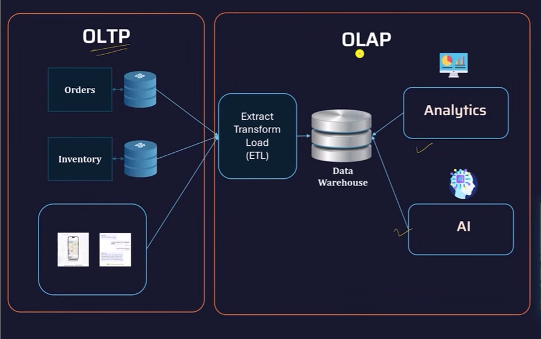
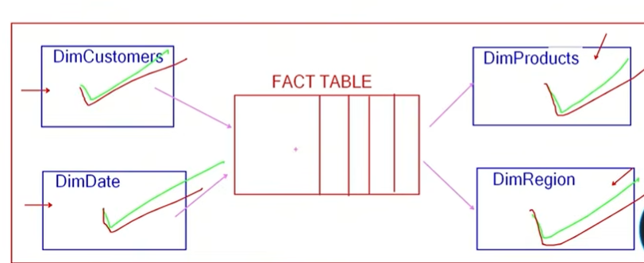
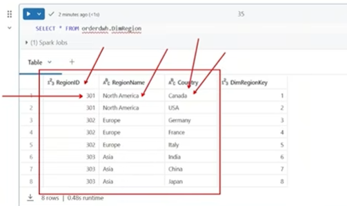
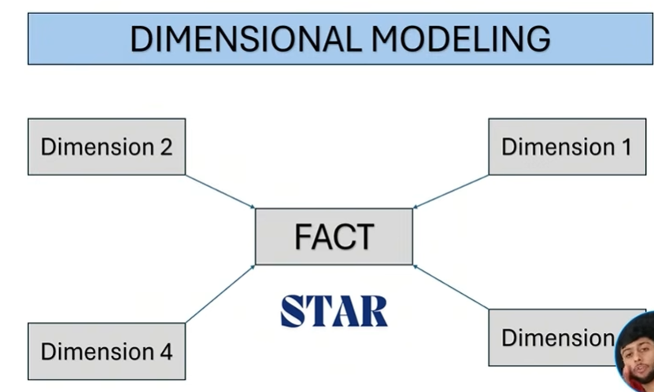
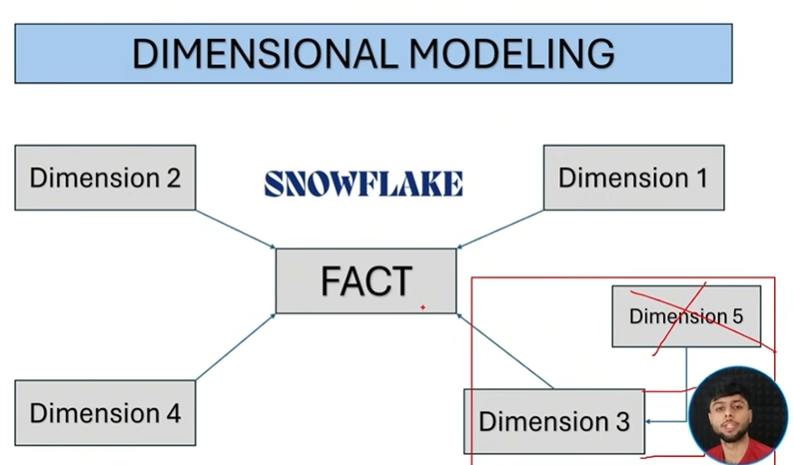
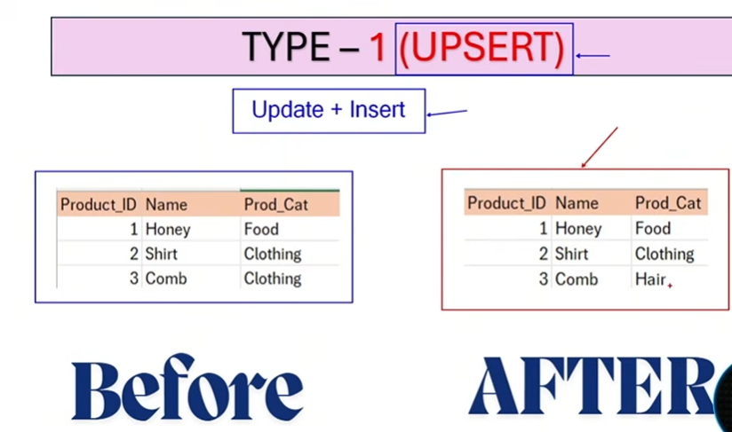
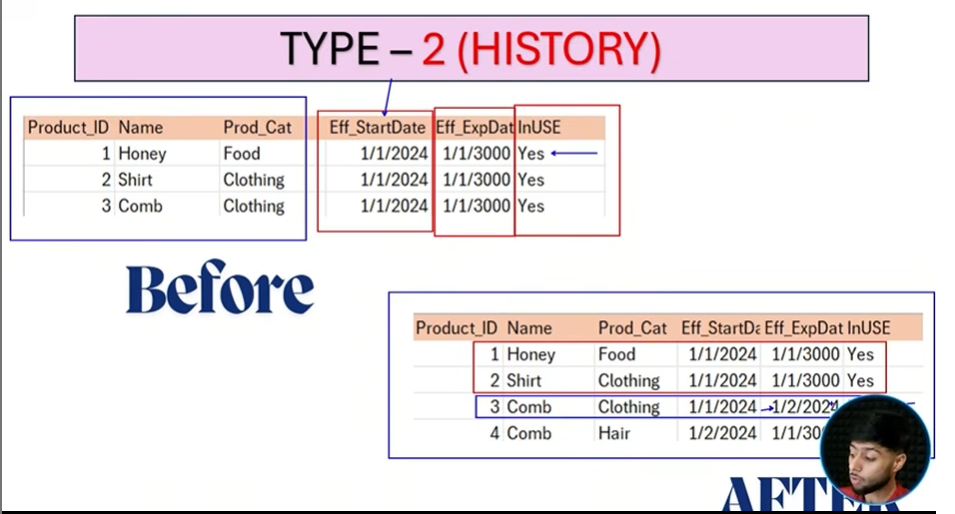
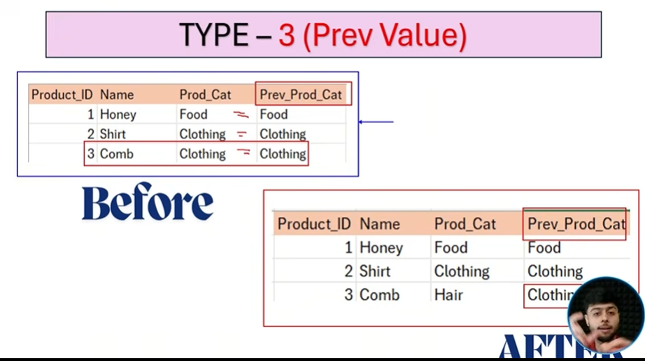

# 🏗️ Data Warehousing — Complete Study Guide

> A thorough walkthrough of Data Warehousing concepts, architecture, data modelling, and slowly changing dimensions.

---

## Table of Contents

1. [Why Data Warehousing?](#1-why-data-warehousing)
2. [OLTP vs OLAP](#2-oltp-vs-olap)
3. [Data Lake vs Data Warehouse vs Data Lakehouse](#3-data-lake-vs-data-warehouse-vs-data-lakehouse)
4. [Data Warehouse Architecture](#4-data-warehouse-architecture)
5. [Staging Area — Transient vs Persistent](#5-staging-area--transient-vs-persistent)
6. [Incremental Loading & CDC](#6-incremental-loading--cdc)
7. [SQL Walkthrough — Building a DWH](#7-sql-walkthrough--building-a-dwh)
8. [Data Modelling](#8-data-modelling)
9. [Dimensional Modelling — Facts & Dimensions](#9-dimensional-modelling--facts--dimensions)
10. [Star Schema vs Snowflake Schema](#10-star-schema-vs-snowflake-schema)
11. [Types of Fact Tables](#11-types-of-fact-tables)
12. [Types of Dimension Tables](#12-types-of-dimension-tables)
13. [Slowly Changing Dimensions (SCD)](#13-slowly-changing-dimensions-scd)
14. [Data Mart](#14-data-mart)
15. [Databricks Hierarchy](#15-databricks-hierarchy)

---

## 1. Why Data Warehousing?

An organisation typically has **multiple databases** storing:
- Structured data (relational tables)
- Unstructured data (logs, JSON, documents)
- Streaming data (real-time event feeds)

### Descriptive Analytics Questions (answered by SQL on a DWH)

| Question | Type |
|---|---|
| What % of orders were delivered in full and on time? | Descriptive |
| Which stores are receiving low ratings? | Descriptive |

These are answered by:
1. Joining tables across multiple databases using SQL
2. Performing **aggregation**
3. Normalising data into **analytics-ready** form

### Predictive / Prescriptive Questions

> *"Festival season is coming — what kind of discounts can increase our order value?"*

This requires **ML models** built on top of the clean data in the warehouse — not just SQL queries. This is where a Data Warehouse becomes the backbone for advanced analytics and data science.

---

## 2. OLTP vs OLAP

| Feature | OLTP | OLAP |
|---|---|---|
| Full Form | Online Transactional Processing | Online Analytical Processing |
| Purpose | Day-to-day business operations | Analytics and reporting |
| Operations | INSERT, UPDATE, DELETE | SELECT (heavy reads) |
| Data Volume | Small per transaction | Large, historical |
| Optimised For | Write speed | Read/query speed |
| Example | Order management, banking | Sales dashboards, BI tools |
| Schema | Normalised (3NF) | Denormalised (Star/Snowflake) |

> 💡 **Key Insight:** You should **never run heavy analytical queries on a production OLTP database**. It degrades write performance and slows down the live system. This is the core reason a Data Warehouse exists.

---

## 3. Data Lake vs Data Warehouse vs Data Lakehouse



### Data Lake

A **cloud storage location where all raw data is dumped** — structured, unstructured, and streaming. The staging area *is* a data lake.

**Popular Data Lakes:**
- Amazon S3
- Azure Data Lake Storage (ADLS)
- Google Cloud Storage

### Comparison Table

| Feature | Data Lake | Data Warehouse | Data Lakehouse |
|---|---|---|---|
| **Purpose** | Raw data storage | Clean, analytics-ready data | Best of both |
| **Data Types** | Structured + Unstructured | Structured only | Structured + Unstructured |
| **Cost** | Cheap (S3, ADLS) | High (Redshift, BigQuery) | Medium |
| **Query Performance** | Slower | Fast for analytics | Fast |
| **ACID Transactions** | Not guaranteed | Fully supported | Supported |
| **Examples** | Amazon S3, ADLS | Amazon Redshift, Google BigQuery | Databricks Delta Lake, Apache Iceberg |

### Data Lakehouse

Combines the **low-cost storage of a data lake** with the **performance and ACID guarantees of a data warehouse** into a unified platform.

**Popular Data Lakehouses:**
- **Databricks** — Delta Lake
- **Apache** — Iceberg

---

## 4. Data Warehouse Architecture

A Data Warehouse has two primary internal layers:

```
Source Systems (Databases)
        │
        ▼
┌───────────────────┐
│   STAGING AREA    │  ← Raw data, no transformation (messy)
│  (Data Lake / S3) │
└────────┬──────────┘
         │  Transform (clean, validate, join)
         ▼
┌───────────────────┐
│    CORE LAYER     │  ← Clean, structured, analytics-ready (pleasant)
│  (Data Warehouse) │
└────────┬──────────┘
         │
         ▼
  Analysts / Scientists / ML Models / Dashboards
```

| Layer | Description |
|---|---|
| **Staging Area** | Receives data in **raw form** — no transformation. Messy, temporary. |
| **Core Layer** | Transformed, clean data. Accessed by analysts and data scientists. |

> 💡 The **staging area is messy**; the **data warehouse is pleasant**.

---

## 5. Staging Area — Transient vs Persistent

Inside the staging area, there are two sub-types:

| Type | Behaviour | Use Case |
|---|---|---|
| **Transient** | Data is **truncated** after loading into core | Most common. No history kept in staging. |
| **Persistent** | Data is **saved/retained** in staging | When you need staging history for auditing or reprocessing. |

> ✅ In **most cases**, the transient approach is used — staging is just a pass-through.

---

## 6. Incremental Loading & CDC

### The Problem

If you reload *all* data every day, you're reprocessing millions of rows unnecessarily. Data that has already been processed should **not** be processed again.

### Solution: Change Data Capture (CDC)

**CDC** tracks what has changed in the source system since the last load.

**How it works:**

1. **Initial Load** — Load all data. Record the `MAX(OrderDate)` as the CDC watermark.
2. **Next Day (Incremental Load)** — Query only records where `OrderDate > last_watermark`.
3. Only new/changed records flow through the pipeline.

```
Day 1 (Initial):   Load ALL → CDC watermark = 2024-02-10
Day 2 (Increment): Load WHERE OrderDate > '2024-02-10' only
Day 3 (Increment): Load WHERE OrderDate > 'new max date' only
```

> 💡 This is the **core idea of incremental loading** — never reprocess what's already been processed.

---

## 7. SQL Walkthrough — Building a DWH

> Using **Spark SQL** (standard SQL syntax used in Databricks — not Apache Spark RDD/DataFrame API)

### Initial Load

```sql
-- Create the warehouse database
CREATE DATABASE salesDWH;

-- STAGING LAYER: Extract raw data
CREATE TABLE salesDWH.stg_sales AS
SELECT * FROM sales.orders;

-- TRANSFORMATION: Clean data via a view
CREATE VIEW salesDWH.trans_sales AS
SELECT * FROM salesDWH.stg_sales
WHERE quantity IS NOT NULL;
-- (other transformations: derived columns, type casting, etc.)

-- CORE LAYER: Load transformed data
CREATE TABLE salesDWH.core_sales AS
SELECT * FROM salesDWH.trans_sales;

-- Display
SELECT * FROM salesDWH.core_sales;
```

### Incremental Load (Next Day — 5 new records added)

```sql
-- STAGING LAYER: Extract only new records using CDC watermark
CREATE OR REPLACE TABLE salesDWH.stg_sales AS
SELECT * FROM sales.orders
WHERE OrderDate > '2024-02-10';  -- last watermark date

-- TRANSFORMATION: Same view logic applies
-- (view re-evaluates automatically from updated stg_sales)

-- CORE LAYER: Upsert / append new data
CREATE OR REPLACE TABLE salesDWH.core_sales (
    OrderID       INT,
    CustomerID    INT,
    ProductID     INT,
    Quantity      DECIMAL,
    UnitPrice     DECIMAL,
    TotalAmount   DECIMAL,
    OrderDate     DATE,
    Country       STRING
    -- ... all other attributes
);

INSERT INTO salesDWH.core_sales
SELECT * FROM salesDWH.trans_sales;
```

---

## 8. Data Modelling

**Data modelling** is the process of structuring your data so it is organised, consistent, and queryable efficiently.

### Three Levels of Data Models

```
Conceptual  →  Logical  →  Physical
(What)          (How)       (Implementation)
```

| Level | Description | Example |
|---|---|---|
| **Conceptual** | High-level business entities and relationships | "We have Orders, Customers, Products tables" |
| **Logical** | How tables connect — joining keys, relationships | CustomerID links Orders → Customers |
| **Physical** | Actual tables, data types, constraints in the DB | `CREATE TABLE`, primary keys, indexes |

---

## 9. Dimensional Modelling — Facts & Dimensions

Dimensional modelling is a **logical model** approach that organises data into **Fact Tables** and **Dimension Tables**.



### Fact Table

- Stores **measurable, numeric values** (metrics) and **foreign keys** to dimensions
- Represents **events or transactions** at the most granular level
- You can **aggregate** fact columns (SUM, AVG, COUNT)

```sql
CREATE TABLE orderDWH.FactSales (
    OrderID         INT,
    Quantity        DECIMAL,
    UnitPrice       DECIMAL,
    TotalAmount     DECIMAL,
    DimProductsKey  INT,      -- FK → DimProducts
    DimCustomersKey INT,      -- FK → DimCustomers
    DimRegionsKey   INT,      -- FK → DimRegions
    DimDateKey      INT       -- FK → DimDate (always separate!)
);
```

> 💡 **Always keep Date as a separate Dimension.** `DimDate` enables powerful time-based analytics (week, month, quarter, fiscal year, holidays, etc.)

### Dimension Table

- Stores **descriptive attributes** — the "who, what, where, when, why"
- **No raw numeric aggregation** columns
- Provides context to interpret the facts

```sql
CREATE TABLE orderDWH.DimCustomers (
    DimCustomerKey INT,       -- Surrogate key (generated)
    CustomerID     INT,       -- Natural/business key
    CustomerName   STRING,
    CustomerEmail  STRING
);
```

### Building Dimensions via View + Insert

```sql
-- Create a view to derive the dimension
CREATE OR REPLACE VIEW orderDWH.view_DimCustomers AS
SELECT
    T.*,
    ROW_NUMBER() OVER (ORDER BY T.CustomerID) AS DimCustomerKey
FROM (
    SELECT DISTINCT
        CustomerID,
        CustomerName,
        CustomerEmail
    FROM orderDWH.trans_sales
) AS T;

-- Populate the dimension table
INSERT INTO orderDWH.DimCustomers
SELECT * FROM orderDWH.view_DimCustomers;
```

> Repeat this pattern for `DimProducts`, `DimRegions`, `DimDate`, etc.

### Loading the Fact Table

```sql
SELECT
    F.OrderID,
    F.Quantity,
    F.UnitPrice,
    F.TotalAmount,
    DC.DimCustomersKey,
    DP.DimProductsKey,
    DR.DimRegionKey,
    DD.DimDateKey
FROM
    orderDWH.trans_sales F
LEFT JOIN orderDWH.DimCustomers DC  ON F.CustomerID = DC.CustomerID
LEFT JOIN orderDWH.DimProducts DP   ON F.ProductID  = DP.ProductID
LEFT JOIN orderDWH.DimRegion DR     ON DR.Country   = F.Country
LEFT JOIN orderDWH.DimDate DD       ON F.OrderDate  = DD.OrderDate;
```

### DimRegion — Composite Key Example

When no single column uniquely identifies a row, use a **composite key** (e.g., combination of `RegionID + RegionName + Country`).



---

## 10. Star Schema vs Snowflake Schema

### Star Schema ⭐

- One **central Fact table** surrounded by **denormalised Dimension tables**
- Dimensions are **not connected to each other** — no hierarchy
- Simple, fast for queries
- **Used by ~90% of companies**



```
        DimCustomers
             │
DimDate ── FactSales ── DimProducts
             │
         DimRegion
```

### Snowflake Schema ❄️

- One **central Fact table** with **normalised, hierarchical Dimension tables**
- Dimensions can have **child dimensions** (e.g., `DimCity → DimCountry → DimContinent`)
- More storage-efficient but **more complex joins**
- Less commonly used in practice



| Feature | Star Schema | Snowflake Schema |
|---|---|---|
| Dimension Structure | Flat / Denormalised | Hierarchical / Normalised |
| Query Complexity | Simple | More complex joins |
| Query Performance | Faster | Slightly slower |
| Storage | More redundancy | Less redundancy |
| Industry Usage | ~90% of companies | Less common |

---

## 11. Types of Fact Tables

### 1. Granular / Transactional Fact Table ✅ (Most Common)

- **1 row = 1 transaction**
- Granularity is never changed
- Most commonly used in practice

```
OrderID | CustomerID | ProductID | Quantity | UnitPrice | OrderDate
1001    | C01        | P05       | 3        | 500       | 2024-01-15
1002    | C02        | P01       | 1        | 1200      | 2024-01-15
```

### 2. Periodic / Snapshot Fact Table

- **1 row ≠ 1 transaction**
- Captures the **state at a fixed interval** (daily, monthly, weekly snapshot)
- Example: Monthly inventory levels, monthly account balances

```
AccountID | Month    | OpeningBalance | Deposits | Withdrawals | ClosingBalance
A001      | 2024-01  | 10000          | 5000     | 2000        | 13000
A001      | 2024-02  | 13000          | 3000     | 1500        | 14500
```

### 3. Accumulating Fact Table

- **1 row = 1 process/lifecycle** (not one event)
- Contains **multiple date/timestamp columns** tracking the journey of a single record
- Common in order fulfilment, claims processing, recruitment pipelines

```
OrderID | OrderDate  | PickedDate | ShippedDate | DeliveredDate | Status
5001    | 2024-01-01 | 2024-01-02 | 2024-01-03  | 2024-01-05    | Delivered
5002    | 2024-01-03 | 2024-01-04 | NULL        | NULL          | In Transit
```

---

## 12. Types of Dimension Tables

### 1. Conformed Dimensions

A dimension **shared across multiple fact tables** without modification.

```
DimProducts
    │               │
FactOrders     FactCancellations
```

> The same `DimProducts` table serves both fact tables unchanged. This ensures consistency across the warehouse.

### 2. Role-Playing Dimensions

A **single dimension used multiple times** in the same fact table, each time playing a different role.

Example: `DimDate` used as both `OrderDate` and `CancelledDate` in `FactOrders`:

```sql
SELECT
    F.OrderID,
    OD.FullDate AS OrderDate,
    CD.FullDate AS CancelledDate
FROM FactOrders F
LEFT JOIN DimDate OD ON F.OrderDateKey      = OD.DimDateKey
LEFT JOIN DimDate CD ON F.CancelledDateKey  = CD.DimDateKey;
```

> `DimDate` plays two roles — it's aliased differently but it's the same table.

### 3. Junk Dimension

A dimension that groups together **low-cardinality flags and indicators** that don't belong in their own dimension.

Example: Instead of storing `PaymentMethod`, `IsGift`, `IsReturnable` in the fact table or making 3 tiny dimensions, combine them:

```
DimJunk:
PaymentMethod | IsGift | IsReturnable
Credit Card   | Yes    | No
Cash          | No     | Yes
```

> Also applies to geographic hierarchies with few values:  
> `Country A → Continent X`, `Country B → Continent X` → these belong in a small junk or conformed dimension.

### 4. Degenerate Dimension

A **dimension with only one attribute** (usually a key) that **has no corresponding dimension table** — it lives directly in the fact table.

Example: `OrderID` itself — it's a descriptor, not a metric, but there's nothing else to group with it.

```
FactSales: OrderID | Quantity | UnitPrice | ...
           ↑
           Degenerate Dimension (no DimOrder table needed)
```

---

## 13. Slowly Changing Dimensions (SCD)

> In normalisation, we go up to **3NF** in industry.  
> In SCD, there are 6 types — but industry uses up to **Type 2**.

SCDs handle the challenge: **what happens when dimension data changes over time?**

Example scenarios:
- A new product is added next month
- A product's category changes

You don't rebuild the fact table from scratch — you use **Slowly Changing Dimensions**.

---

### SCD Type 0 — No Change

The dimension value **never changes**. If the source changes, the warehouse ignores it.

> Use when: historical accuracy of the original value is critical (e.g., date of birth).

---

### SCD Type 1 — Upsert (Overwrite)

**Update if exists, Insert if new** — no history kept.



| ProductID | ProductName | Category  |
|-----------|-------------|-----------|
| P01       | Shampoo     | Hair Care |  ← updated (was "Clothing")

```sql
MERGE INTO sales_scd.DimProducts AS trg
USING sales_scd.view_DimProducts AS src
ON trg.ProductID = src.ProductID
WHEN MATCHED THEN UPDATE SET *
WHEN NOT MATCHED THEN INSERT *;
```

> **Pros:** Simple  
> **Cons:** History is lost — you can't see what the category was before

---

### SCD Type 2 — Historical Tracking (Add New Row)

Preserves **full history** by adding a new row for each change, with effective date columns.



Three extra columns are added:

| Column | Purpose |
|---|---|
| `eff_StartDate` | When this version became active |
| `eff_ExpDate` | When this version expired (set far future: `9999-12-31`) |
| `inUse` | Boolean flag (`YES` / `NO`) — is this the current record? |

```
ProductID | ProductName | Category  | eff_StartDate | eff_ExpDate | inUse
P01       | Shampoo     | Clothing  | 2023-01-01    | 2024-03-14  | NO
P01       | Shampoo     | Hair Care | 2024-03-15    | 9999-12-31  | YES
```

> **Pros:** Full history preserved — you can query what the data looked like on any date  
> **Cons:** Table grows over time; queries need to filter `WHERE inUse = 'YES'` for current records

---

### SCD Type 3 — Previous Value Column

Instead of a new row, **add a new column** to store the previous value.



```
ProductID | ProductName | Prev_Category | Current_Category
P01       | Shampoo     | Clothing      | Hair Care
```

> **Pros:** Simple — no extra rows, easy to compare old vs new  
> **Cons:** Only tracks **one change back** — if the category changes a third time, the oldest history is lost

---

### SCD Comparison Summary

| Type | Strategy | History | Complexity |
|---|---|---|---|
| Type 0 | Never change | N/A | None |
| Type 1 | Overwrite | Lost | Low |
| Type 2 | Add new row | Full | Medium |
| Type 3 | Add prev column | One version back | Low-Medium |

---

### SCD Type 1 — Full Implementation

```sql
-- View that always reflects latest source data
CREATE OR REPLACE VIEW sales_scd.view_DimProducts AS
SELECT
    ProductID,
    ProductName,
    Category
FROM sales.products;

-- Merge (upsert) into the dimension table
MERGE INTO sales_scd.DimProducts AS trg
USING sales_scd.view_DimProducts AS src
ON trg.ProductID = src.ProductID
WHEN MATCHED THEN UPDATE SET *
WHEN NOT MATCHED THEN INSERT *;

-- Verify
SELECT * FROM sales_scd.DimProducts;
```

---

## 14. Data Mart

A **Data Mart** is a **subset of a Data Warehouse**, scoped to a specific **department or business function**.

```
Data Warehouse (entire company)
    ├── Data Mart: HR Department
    ├── Data Mart: Finance / Budgets
    ├── Data Mart: Marketing
    └── Data Mart: IT / Operations
```

> 💡 If the Data Warehouse is the whole company's data, each Data Mart is one department's view of it.

### Types of Data Marts

| Type | Description |
|---|---|
| **Dependent** | Derived directly from the central data warehouse |
| **Independent** | Built directly from source systems (no central DWH) |
| **Hybrid** | Combination of both |

---

## 15. Databricks Hierarchy

In **Databricks**, the metadata/storage hierarchy is:

```
Metastore (Unity Catalog — top level)
    └── Catalog
            └── Database (Schema)
                    └── Tables / Views
```

```sql
-- Example: creating a warehouse in Databricks
CREATE DATABASE salesDWH;

-- Full reference: catalog.database.table
SELECT * FROM main.salesDWH.core_sales;
```

---

## Quick Reference Cheat Sheet

| Concept | One-Line Summary |
|---|---|
| OLTP | Write-heavy; live transactions |
| OLAP | Read-heavy; analytics on historical data |
| Data Lake | Cheap, raw, all data types |
| Data Warehouse | Expensive, clean, structured only |
| Data Lakehouse | Best of both worlds |
| Staging Area | Raw ingestion layer; messy |
| Core Layer | Clean, transformed, analytics-ready |
| CDC | Track changes to avoid reprocessing |
| Fact Table | Numeric metrics + foreign keys; granular events |
| Dimension Table | Descriptive attributes; the "who/what/where" |
| Star Schema | Flat dimensions around one fact; fast, simple |
| Snowflake Schema | Hierarchical dimensions; normalised |
| SCD Type 1 | Overwrite — no history |
| SCD Type 2 | New row per change — full history ✅ |
| SCD Type 3 | Extra column — one version back |
| Data Mart | Department-level subset of DWH |
| Conformed Dim | Shared across multiple fact tables |
| Role-Playing Dim | Same dim, multiple relationships in one fact |
| Junk Dim | Low-cardinality flags grouped together |
| Degenerate Dim | Single-attribute dim with no dimension table |

---

*Built with Spark SQL on Databricks · Concepts apply to Redshift, BigQuery, Synapse, and Snowflake as well*