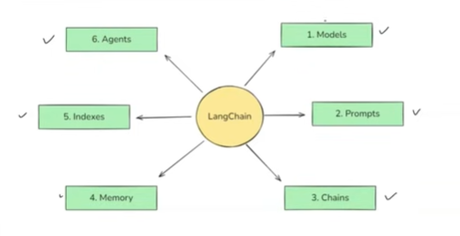
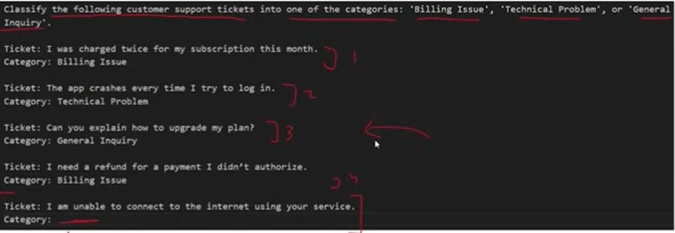
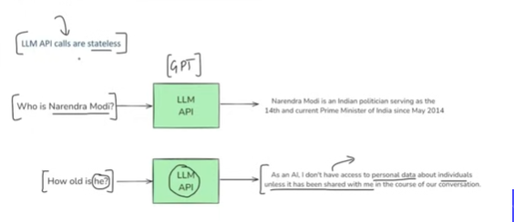

## Overview

**LangChain** is an open-source framework for developing applications powered by Large Language Models (LLMs). It provides a standardized interface to work with various AI models and tools, making it easier to build complex AI-powered applications.

---

## Core Components



LangChain consists of six main components that work together to create powerful AI applications:

### 1. Models

Models are the core interfaces through which you interact with AI models. LangChain provides a unified interface to work with different AI providers.

**Problem:** Without LangChain, implementing multiple AI models (e.g., OpenAI and Anthropic) in a single application requires writing different code for each provider.

**Solution:** LangChain provides a standardized interface:

```python
from langchain_openai import ChatOpenAI 
from langchain_anthropic import ChatAnthropic
from dotenv import load_dotenv 

load_dotenv()

model1 = ChatOpenAI(model="gpt-4", temperature=0)
model2 = ChatAnthropic(model="claude-3-opus-20240229")

result1 = model1.invoke("Hey")
result2 = model2.invoke("Hey")

print(result1.content)
print(result2.content)
```

#### Types of Models in LangChain:

- **Language Models**: Input text → Output text (for chat and text generation)
- **Embedding Models**: Input text → Output vector (used for semantic search and similarity)

---

### 2. Prompts

LangChain makes prompt engineering more powerful and reusable through various templating techniques.

#### 2.1 Dynamic & Reusable Prompts

Create templates with variables that can be dynamically filled:

```python
from langchain_core.prompts import PromptTemplate

prompt = PromptTemplate.from_template("Summarize {topic} in {emotion} tone")
print(prompt.format(topic="Cricket", emotion="fun"))
```

#### 2.2 Role-Based Prompts

Define system and user roles for structured conversations:

```python
chat_prompt = ChatPromptTemplate.from_template([
    ("system", "Hi you are an experienced {profession}"),
    ("user", "Tell me about {topic}"),
])

formatted_messages = chat_prompt.format_messages(
    profession="Doctor",
    topic="Viral Fever"
)
```

#### 2.3 Few-Shot Prompting

Provide examples to guide the LLM's behavior:

```python
examples = [
    {
        "input": "I was charged twice for my subscription this month.",
        "output": "Billing Issue"
    },
    {
        "input": "The app crashes every time I try to log in.",
        "output": "Technical Problem"
    },
    {
        "input": "Can you explain how to upgrade my plan?",
        "output": "General Inquiry"
    },
    {
        "input": "I need a refund for a payment I didn't authorize.",
        "output": "Billing Issue"
    },
]

# Create an example template
example_template = """
Ticket: {input}
Category: {output}
"""

# Build the few-shot prompt template
few_shot_prompt = FewShotPromptTemplate(
    examples=examples,
    example_prompt=PromptTemplate(
        input_variables=["input", "output"],
        template=example_template
    ),
    prefix="Classify the following customer support tickets into one of the categories: 'Billing Issue', 'Technical Problem', or 'General Inquiry'.\n\n",
    suffix="\nTicket: {user_input}\nCategory:",
    input_variables=["user_input"],
)
```



---

### 3. Chains

Chains allow you to create pipelines where the output of one stage becomes the input of the next stage.

#### Sequential Chain
Processes steps one at a time in order.

#### Parallel Chain
Runs multiple LLMs simultaneously and combines their outputs:

```
Input ───┬──> LLM 1 ──┐
         │            ├──> LLM 3 ──> Report ──> Output
         └──> LLM 2 ──┘
```

#### Conditional Chain
Routes processing based on conditions. 

**Example Use Case:** AI agent that receives feedback from users
- If feedback is positive → Respond with "Thank you"
- If feedback is negative → Redirect to customer support email

---

### 4. Indexes

Indexes connect your application to external knowledge sources such as PDFs, websites, or databases.

#### Components:
- **Document Loader**: Loads documents from various sources
- **Text Splitter**: Breaks documents into manageable chunks
- **Vector Store**: Stores embeddings for semantic search
- **Retrievers**: Retrieves relevant information based on queries

**Example Use Case:** 
You ask: "Can you explain Section 80C?" 

The model doesn't have this knowledge by default, but you can provide the Indian Laws & Regulations PDF as an index (external knowledge store) for the model to reference.

---

### 5. Memory

**Important:** LLM API calls are stateless by default. Memory components help maintain context across conversations.



#### Types of Memory:

1. **ConversationBufferMemory**
   - Stores a complete transcript of recent messages
   - Great for short chats but can grow large quickly

2. **ConversationBufferWindowMemory**
   - Only keeps the last N interactions
   - Helps avoid excessive token usage

3. **Summarizer-Based Memory**
   - Periodically summarizes older chat segments
   - Maintains a condensed memory footprint

4. **Custom Memory**
   - For advanced use cases
   - Store specialized state (e.g., user preferences or key facts)

---

### 6. Agents

An **AI Agent** is an evolution of a standard chatbot.

**Standard Chatbot:**
- Uses LLMs for Natural Language Understanding (NLU)
- Generates text responses (Text Generation)

**AI Agent:**
- A "Chatbot with superpowers"
- Enhanced capabilities beyond just conversation
- Can take actions and interact with external systems

#### Use Case: Travel Booking Agent

```
User Input
    ↓
"I want to book a trip to Shimla or Manali for 24th Jan"
    ↓
AI Agent
    ↓
API Call to Indigo Airlines
    ↓
Flight Booked ✓
```

**The Process:**
1. **Context**: User interacts with a travel website
2. **Parameters**: Destination (Shimla/Manali) and date (24th Jan)
3. **Action**: Agent takes action via API
4. **Integration**: Connects to external service (Indigo Airlines)
5. **Result**: Successfully books the flight

Unlike passive chatbots, agents can perform real-world tasks by integrating with external APIs and services.

---

