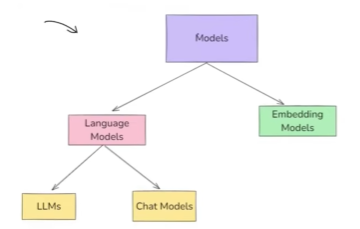

# 📘 LangChain – Model Component

## 📌 Overview

The **Model Component** in **LangChain** is a core abstraction that enables seamless interaction with:

* Language Models (LLMs)
* Chat Models
* Embedding Models

LangChain hides the low-level complexity of working directly with different providers (OpenAI, Google, Hugging Face, etc.) and exposes a **uniform interface**.
This makes it easier to build applications involving:

* AI-generated text
* Conversational AI
* Semantic search
* Retrieval-Augmented Generation (RAG)

---

## 🧩 Types of Models in LangChain




---

LangChain models broadly fall into **two categories**:

---

## 1️⃣ Text-to-Text Models (Language Models)

These models take **text as input** and return **text as output**.

### A) LLMs (Base Language Models)

**Definition**
LLMs are general-purpose models used for **raw text generation**.

* Input → Plain text
* Output → Plain text
* Older generation models
* Less conversational awareness

**Examples**

* GPT-3
* LLaMA-2-7B
* Mistral-7B
* OPT-1.3B

---

### B) Chat Models (Instruction-Tuned Models)

Chat models are optimized for conversational tasks.

* Input → List of messages
* Output → Chat message
* Understands roles: `system`, `user`, `assistant`

**Examples**

* GPT-4
* GPT-3.5-turbo
* LLaMA-2-Chat
* Claude
* Gemini

---

## 🔍 LLMs vs Chat Models

| Feature              | LLMs                | Chat Models           |
| -------------------- | ------------------- | --------------------- |
| Input                | Plain text          | Structured messages   |
| Role awareness       | ❌                   | ✅                     |
| Conversation support | ❌                   | ✅                     |
| Use case             | One-shot generation | Chatbots & assistants |

---

## 2️⃣ Embedding Models (Text → Vectors)

Embedding models convert text into a **vector (array of numbers)** representing semantic meaning.

Example:

```
"Delhi is the capital of India"
↓
[0.021, -0.884, 0.194, ...]
```

Used for:

* Semantic search
* Similarity comparison
* RAG
* Clustering

---

## 🔥 Model Temperature

`temperature` controls randomness of responses.

| Use Case         | Temperature |
| ---------------- | ----------- |
| Factual answers  | 0.0 – 0.3   |
| General Q&A      | 0.5 – 0.7   |
| Creative writing | 0.9 – 1.2   |
| Brainstorming    | 1.5+        |

Lower → deterministic
Higher → creative

---

## 🌍 Open Source vs Closed Source Models

| Feature       | Open Source | Closed Source    |
| ------------- | ----------- | ---------------- |
| Cost          | Free        | Paid             |
| Deployment    | Anywhere    | Provider only    |
| Customization | Full        | Limited          |
| Privacy       | Local       | Sent to provider |

---

## 🔐 Hugging Face Setup

1. Create a token at
   [https://huggingface.co/settings/tokens](https://huggingface.co/settings/tokens)
2. Select **Read access**
3. Add to `.env`

```
HUGGINGFACEHUB_ACCESS_TOKEN=your_token_here
```

---

## 🧠 Important Note

Embedding document vectors is computationally expensive.

Best practice:

* Generate once
* Store in a **Vector Database**
* Reuse for queries

---

## 📌 Key Takeaways

* LangChain abstracts multiple providers
* Chat models are preferred for conversational apps
* Embeddings power semantic understanding
* Temperature controls creativity
* Vector DBs are essential for scalable RAG

