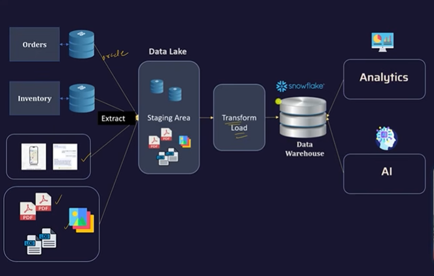

# ❄️ Snowflake — Cloud-Based SQL Data Warehouse

> A complete guide to Snowflake's architecture, features, and how it compares to traditional data warehouses.

---

## Table of Contents

1. [What is Snowflake?](#1-what-is-snowflake)
2. [RDBMS vs Data Warehouse (Snowflake)](#2-rdbms-vs-data-warehouse-snowflake)
3. [Traditional Data Warehouse vs Snowflake](#3-traditional-data-warehouse-vs-snowflake)
4. [Cloud Native, Fully Managed](#4-cloud-native-fully-managed)
5. [Separation of Compute and Storage](#5-separation-of-compute-and-storage)
6. [Automatic Performance Optimization](#6-automatic-performance-optimization)
7. [Structured and Semi-Structured Data Support](#7-structured-and-semi-structured-data-support)
8. [Time Travel and Zero-Copy Cloning](#8-time-travel-and-zero-copy-cloning)
9. [Built-in Security and Data Governance](#9-built-in-security-and-data-governance)
10. [Other Key Features](#10-other-key-features)
11. [Hands-On: Loading Data from S3 (Tasty Bytes)](#11-hands-on-loading-data-from-s3-tasty-bytes)

---

## 1. What is Snowflake?



Snowflake is a **cloud-based AI Data Platform** that combines:

- Data Warehousing
- Data Engineering
- Machine Learning
- AI Application Development
- Data Sharing
- Governance

...all in a **unified environment**.

At its core, Snowflake is a **cloud-based SQL Data Warehouse** built for analytics (OLAP), designed to replace traditional on-premise data warehouses with a fully managed, scalable, pay-as-you-go model.

---

## 2. RDBMS vs Data Warehouse (Snowflake)

| Feature | RDBMS (e.g., Oracle, MySQL) | Data Warehouse (Snowflake) |
|---|---|---|
| **Primary Use** | Transactions (OLTP) | Analytics (OLAP) |
| **Typical Workload** | Many small reads/writes, high concurrency (day-to-day app transactions like orders, payments, etc.) | Few very large queries scanning billions of rows (large-scale analytics, dashboards) |
| **Management** | Self-managed | Fully managed SaaS |

> 💡 RDBMS = **write-heavy, real-time**. Snowflake = **read-heavy, analytical**.

---

## 3. Traditional Data Warehouse vs Snowflake

| Feature | Traditional Data Warehouse | Snowflake |
|---|---|---|
| **Architecture** | On-prem or VM-based; tightly couples compute & storage | Cloud-native; separates compute and storage |
| **Performance Tuning** | Manual indexing, partitioning, optimization | Automatic optimization (micro-partitioning, pruning, caching) |
| **Data Types Supported** | Structured data only | Structured + semi-structured (JSON, Parquet, Avro) |
| **Maintenance** | Manual backups, patching, tuning | Fully managed SaaS (no admin needed) |
| **Cost Model** | Fixed hardware or license cost | Pay-as-you-go; compute auto-suspends when idle |
| **Cloud Support** | Usually single-cloud or on-prem | Multi-cloud (AWS, Azure, GCP) |
| **Use Case Fit** | Stable, predictable workloads | Dynamic, large-scale, modern analytics workloads |

---

## 4. Cloud Native, Fully Managed

- **SaaS (Software as a Service) platform** — no servers, clusters, or maintenance to manage
- **Runs on AWS, Azure, and GCP** with the same consistent experience across all three
- Security patches, system upgrades, and backups happen automatically with **zero downtime**
- Compute operates on a **per-second, pay-as-you-go credit system**
- Virtual warehouses **auto-suspend** when idle — you stop paying the moment compute goes unused

> 💡 Traditional systems require upfront investment in physical hardware and recurring DBA overhead. Snowflake eliminates both.

---

## 5. Separation of Compute and Storage

In traditional systems, **compute and storage are tightly coupled** — upgrading one means upgrading the other, even if you only need more of one.

In Snowflake, they are **completely independent**:

```
Central Cloud Storage (S3 / ADLS / GCS)
        │
        ├── Virtual Warehouse A  (e.g., BI dashboards)
        ├── Virtual Warehouse B  (e.g., Data Engineering pipelines)
        └── Virtual Warehouse C  (e.g., ML model training)
```

- **Storage** scales to petabytes without touching compute
- **Multiple Virtual Warehouses** can run separate workloads simultaneously against the **exact same data** without resource contention
- You **independently scale up/down** either dimension based on need

> 💡 This is the foundational architectural advantage of Snowflake over every traditional data warehouse.

---

## 6. Automatic Performance Optimization

Snowflake handles all the heavy lifting of tuning, indexing, and physical data distribution **behind the scenes** — no DBA required. This is achieved through three mechanisms:

---

### 6.1 Micro-Partitioning

Traditional databases require you to manually define partition keys and manage static partitions. Snowflake skips all of that.

- **How it works:** Every time you load data, Snowflake automatically breaks it into contiguous, compressed chunks called **micro-partitions** (typically 50 MB – 500 MB of uncompressed data)
- Data is stored in **columnar format**, and Snowflake maps exactly where every column's data lives across these tiny partitions
- This lays the groundwork for highly targeted data scanning

---

### 6.2 Pruning

Pruning is how Snowflake **completely ignores data your query doesn't need**, drastically cutting execution time.

- **How it works:** For every micro-partition, Snowflake captures and maintains metadata — including the **min and max values for every column**
- When a query includes a `WHERE` clause (e.g., `WHERE OrderDate >= '2026-01-01'`), Snowflake checks this metadata first
- If a micro-partition's date range falls entirely outside the filter, Snowflake **prunes (skips) it entirely**
- Only the specific partitions containing relevant data are ever read

> 💡 Pruning saves massive amounts of compute power on large tables — you're never scanning data you don't need.

---

### 6.3 Caching

Snowflake uses **multiple layers of caching** to avoid repeating work, ensuring repetitive dashboard or user queries return results almost instantly.

| Cache Type | What It Does |
|---|---|
| **Result Cache** | Stores query results for 24 hours. If you re-run the exact same query and the data hasn't changed, Snowflake skips compute entirely and returns the result **for free** |
| **Local Disk / SSD Cache** | When a virtual warehouse pulls micro-partitions from central cloud storage, it caches them locally on fast SSDs. Subsequent queries on that same warehouse read from the ultra-fast local cache instead of re-downloading from central storage |

> 💡 These three features (micro-partitioning → pruning → caching) work as a pipeline: data is partitioned intelligently, irrelevant partitions are skipped, and relevant partitions are cached for reuse.

---

## 7. Structured and Semi-Structured Data Support

Traditional databases only handle **structured (relational) data**. Loading semi-structured data like JSON requires building complex ETL pipelines to flatten and parse it first.

Snowflake supports **both natively**:

| Format | Supported? |
|---|---|
| Structured (Tables, Columns) | ✅ |
| JSON | ✅ |
| Parquet | ✅ |
| Avro | ✅ |
| ORC | ✅ |
| XML | ✅ |

### The VARIANT Data Type

Use the `VARIANT` data type to store and query semi-structured data directly:

```sql
-- Semi-structured column stored as VARIANT
menu_item_health_metrics_obj VARIANT

-- Query it using dot-notation and LATERAL FLATTEN
SELECT
    m.menu_item_name,
    obj.value:"ingredients"::ARRAY AS ingredients
FROM menu m,
    LATERAL FLATTEN (input => m.menu_item_health_metrics_obj:menu_item_health_metrics) obj
WHERE menu_item_name = 'Mango Sticky Rice';
```

> 💡 You can ingest raw JSON directly into a `VARIANT` column and run standard SQL over it — no ETL flattening pipeline needed.

---

## 8. Time Travel and Zero-Copy Cloning

Both features are built on Snowflake's underlying architecture where data files (micro-partitions) are **immutable** — they are never overwritten once written. Updates and deletes create new micro-partitions rather than modifying existing ones.

---

### 8.1 Time Travel

Because old data files are never overwritten, Snowflake can look back at the state of your data metadata at any point in time.

```sql
-- Query the sales table exactly as it looked 1 hour (3600 seconds) ago
SELECT * FROM sales AT(OFFSET => -3600);
```

**Use Cases:**
- Someone accidentally drops a table → restore it
- An `UPDATE` ran without a `WHERE` clause → revert the damage
- Historical data audits and compliance checks

**Retention Limits:**

| Account Type | Max Time Travel |
|---|---|
| Standard | 1 day |
| Enterprise | Up to 90 days |

---

### 8.2 Zero-Copy Cloning

Spinning up a dev/test environment with production data traditionally requires copying terabytes of data — taking hours and doubling storage costs.

Snowflake's `CLONE` command creates a **new set of metadata pointers** that reference the exact same immutable micro-partitions as the original — **no data is duplicated**.

```sql
-- Instantly clone a full table or database
CREATE DATABASE prod_clone CLONE production_db;
CREATE TABLE orders_test CLONE orders;
```

- ⚡ Operation is **instantaneous**
- 💾 Costs **zero additional storage** initially
- 🔀 You only pay for storage when changes are made to either copy, as new micro-partitions are created independently for each

> 💡 **Time Travel + Zero-Copy Cloning** together are one of Snowflake's most powerful differentiators for development, testing, and data recovery workflows.

---

## 9. Built-in Security and Data Governance

Snowflake has enterprise-grade security built into every layer:

| Feature | Details |
|---|---|
| **Role-Based Access Control (RBAC)** | Fine-grained permission management through roles |
| **Multi-Factor Authentication (MFA)** | Enforced at the user login level |
| **Always-On Encryption** | Data encrypted both **in-transit** and **at-rest** |
| **Dynamic Data Masking** | Column-level policies to mask sensitive data for specific roles |
| **Row-Level Access Policies** | Restrict which rows specific users/roles can see |

> 💡 No extra configuration needed — encryption is always on by default. You never have an "unencrypted" state.

---

## 10. Other Key Features

### Snowpark and Developer Ecosystem
Snowpark allows developers to write data pipelines and transformations using Python, Java, or Scala — running directly inside Snowflake without moving data out. It bridges the gap between SQL analysts and software engineers.

### Continuous Data Ingestion with Snowpipe
Snowpipe enables **continuous, automatic data loading** as soon as new files land in cloud storage (S3, ADLS, GCS). Unlike batch loads that run on a schedule, Snowpipe is event-driven — it loads micro-batches of data within seconds of arrival.

### Fully Elastic, Pay-as-You-Go
- Compute scales **up or down** on demand — from extra-small to 6X-large virtual warehouses
- **Multi-cluster warehouses** automatically scale out during concurrency spikes and scale back in when traffic drops
- You pay **per second** of compute used, not for reserved capacity

---

## 11. Hands-On: Loading Data from S3 (Tasty Bytes)

> **Context:** Tasty Bytes is a fictitious global food truck network leveraging the Snowflake Data Cloud. This walkthrough demonstrates the end-to-end process of loading a CSV file from S3 Blob Storage into Snowflake.

---

### Step 1 — Set Role and Warehouse Context

```sql
-- Set the Role
USE ROLE SNOWFLAKE_LEARNING_ROLE;

-- Set the Warehouse (compute)
USE WAREHOUSE SNOWFLAKE_LEARNING_WH;

-- Set the Database
USE DATABASE SNOWFLAKE_LEARNING_DB;

-- Set the Schema (dynamic, based on current user)
SET schema_name = CONCAT(current_user(), '_LOAD_SAMPLE_DATA_FROM_S3');
USE SCHEMA IDENTIFIER($schema_name);
```

> 📌 **Tip:** To run a single query, place your cursor in the query and press `⌘-Return`. To run the entire worksheet, press `⌘-Shift-Return`.

---

### Step 2 — Create the Raw Menu Table

```sql
CREATE OR REPLACE TABLE MENU
(
    menu_id                       NUMBER(19,0),
    menu_type_id                  NUMBER(38,0),
    menu_type                     VARCHAR(16777216),
    truck_brand_name              VARCHAR(16777216),
    menu_item_id                  NUMBER(38,0),
    menu_item_name                VARCHAR(16777216),
    item_category                 VARCHAR(16777216),
    item_subcategory              VARCHAR(16777216),
    cost_of_goods_usd             NUMBER(38,4),
    sale_price_usd                NUMBER(38,4),
    menu_item_health_metrics_obj  VARIANT          -- semi-structured JSON column
);

-- Confirm the empty table was created
SELECT * FROM menu;
```

---

### Step 3 — Create a Stage (connect to S3 Blob Storage)

A **Stage** is a named reference to an external storage location (S3, ADLS, GCS) that Snowflake can read from.

```sql
CREATE OR REPLACE STAGE blob_stage
    url         = 's3://sfquickstarts/tastybytes/'
    file_format = (type = csv);

-- List files available in the Stage
LIST @blob_stage/raw_pos/menu/;
```

---

### Step 4 — Load Data from Stage into Table

```sql
COPY INTO menu
FROM @blob_stage/raw_pos/menu/;
```

> 💡 `COPY INTO` is Snowflake's bulk data loading command. It reads files from the Stage and loads them into the target table efficiently.

---

### Step 5 — Query the Loaded Data

```sql
-- How many rows loaded?
SELECT COUNT(*) AS row_count FROM menu;

-- Preview top 10 rows
SELECT TOP 10 * FROM menu;

-- What items does the Freezing Point brand sell?
SELECT
    menu_item_name
FROM menu
WHERE truck_brand_name = 'Freezing Point';

-- What is the profit on Mango Sticky Rice?
SELECT
    menu_item_name,
    (sale_price_usd - cost_of_goods_usd) AS profit_usd
FROM menu
WHERE truck_brand_name = 'Freezing Point'
AND   menu_item_name   = 'Mango Sticky Rice';

-- Extract ingredients from the semi-structured VARIANT column
SELECT
    m.menu_item_name,
    obj.value:"ingredients"::ARRAY AS ingredients
FROM menu m,
    LATERAL FLATTEN (input => m.menu_item_health_metrics_obj:menu_item_health_metrics) obj
WHERE truck_brand_name = 'Freezing Point'
AND   menu_item_name   = 'Mango Sticky Rice';

-- Time Travel: query the sales table as it looked 1 hour ago
SELECT * FROM sales AT(OFFSET => -3600);
```

> 💡 **LATERAL FLATTEN** is used to "explode" nested arrays or objects inside a `VARIANT` column into individual rows — essential for querying semi-structured data like JSON.

---

## Quick Reference Cheat Sheet

| Concept | One-Line Summary |
|---|---|
| Snowflake | Cloud-native, fully managed SQL Data Warehouse (OLAP) |
| Virtual Warehouse | Independent compute cluster; scales separately from storage |
| Micro-Partitioning | Auto-partitioned 50–500 MB compressed columnar chunks |
| Pruning | Skip irrelevant micro-partitions using column min/max metadata |
| Result Cache | Reuse exact query results for 24 hours — free compute |
| SSD Cache | Local warehouse cache of recently accessed micro-partitions |
| VARIANT | Data type for storing and querying semi-structured data (JSON, etc.) |
| Stage | Named pointer to external cloud storage (S3, ADLS, GCS) |
| COPY INTO | Bulk load command from a Stage into a Snowflake table |
| Time Travel | Query historical data states; up to 90 days on Enterprise |
| Zero-Copy Clone | Instant, storage-free copy via metadata pointers |
| Snowpipe | Event-driven continuous ingestion as files land in cloud storage |
| Snowpark | Write Snowflake pipelines in Python, Java, or Scala |
| RBAC | Role-Based Access Control for fine-grained permissions |
| Dynamic Data Masking | Column-level masking policies per role |

---

*Snowflake runs on AWS · Azure · GCP — same experience, zero vendor lock-in*